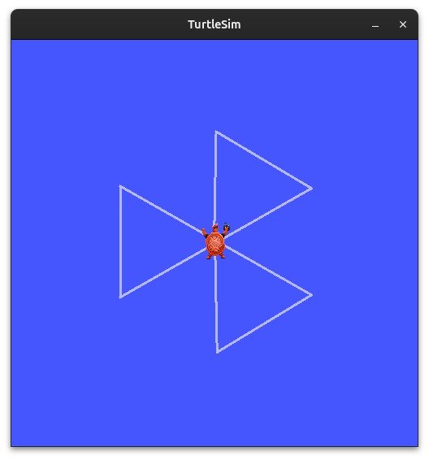
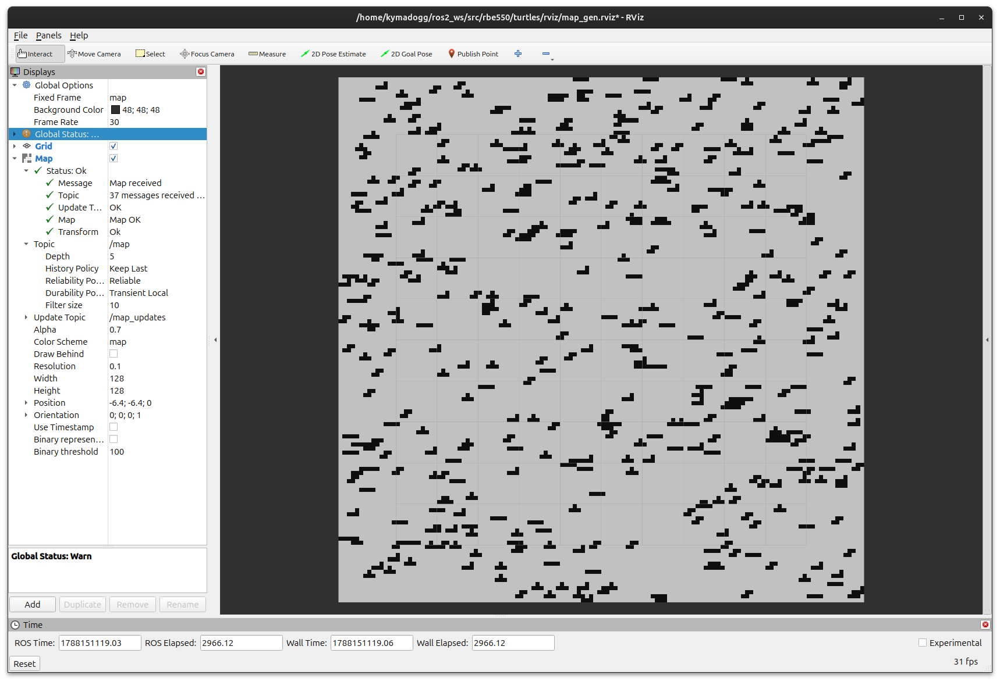
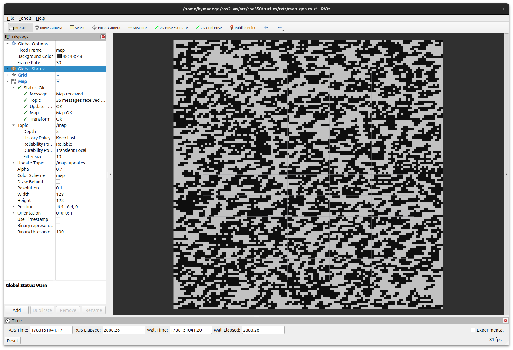
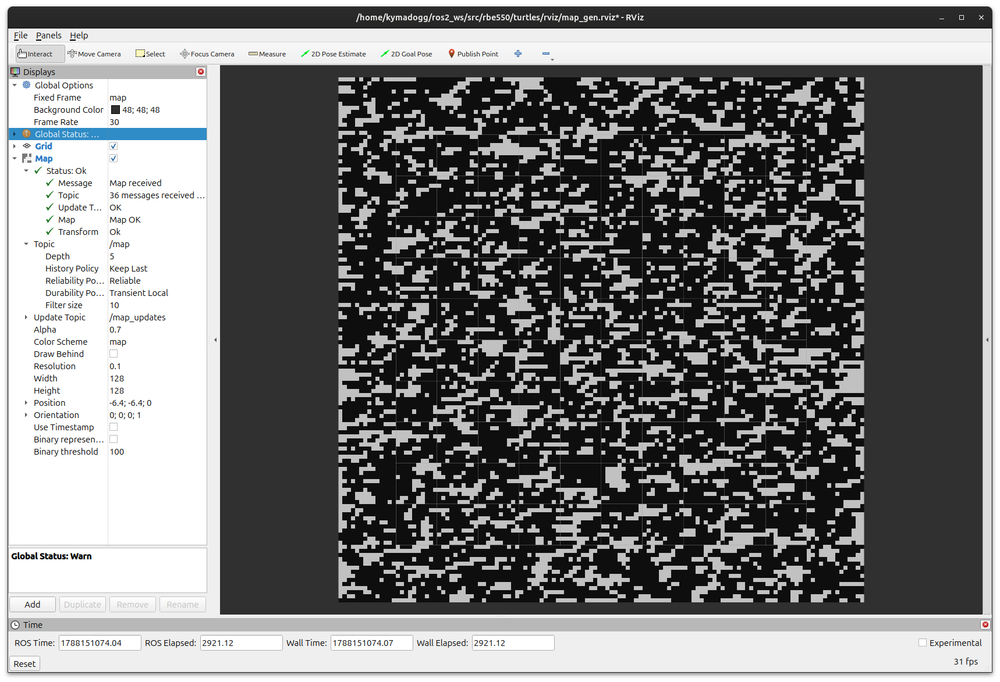

# turtles
Week 1 RBE 550 assignment featuring turtle graphics and specific percent coverage occupancy grid generation. I <3 ROS, so both code modules involve ROS Jazzy Jalisco.

### Dependencies:
- ROS 2 Jazzy Jalisco
    - [OSRF Docker Image](https://hub.docker.com/r/osrf/ros?tag=jazzy-desktop-full)
- `nav_msgs`
- `std_msgs`
- TurtleSim
- Rviz2

## Turtle Graphics
Creating one pass of a Victor Sierra search pattern using TurtleSim and ROS 2.  
### How to run: 
`ros2 launch turtles turtle_graphics.launch.py`
### Results
  
**Figure 1:** A turtle searching for its friends in TurtleSim

### Associated Files
- `src/victor_sierra.py`
- `launch/turtle_graphics.launch.py`

## Obstacle Field
Generating a specific percent obstacle coverage using `nav_msgs/OccupancyGrid` ROS message type.

### How to run:
Terminal One: `ros2 launch turtles obstacle_field.launch.py`  

Terminal Two: `ros2 service call /generate_map turtles/srv/GenerateMap "{coverage: float}"`
> "float" should be a float value ranging from 0.0 to 100.0

### Results
  
**Figure 2:** An OccupancyGrid with 10% Obstacle Coverage

  
**Figure 3:** An OccupancyGrid with 50% Obstacle Coverage

  
**Figure 4:** An OccupancyGrid with 70% Obstacle Coverage

### Associated Files
- `src/field.py`
- `launch/obstacle_field.launch.py`
- `rviz/map_gen.rviz`
- `srv/GenerateMap.srv`